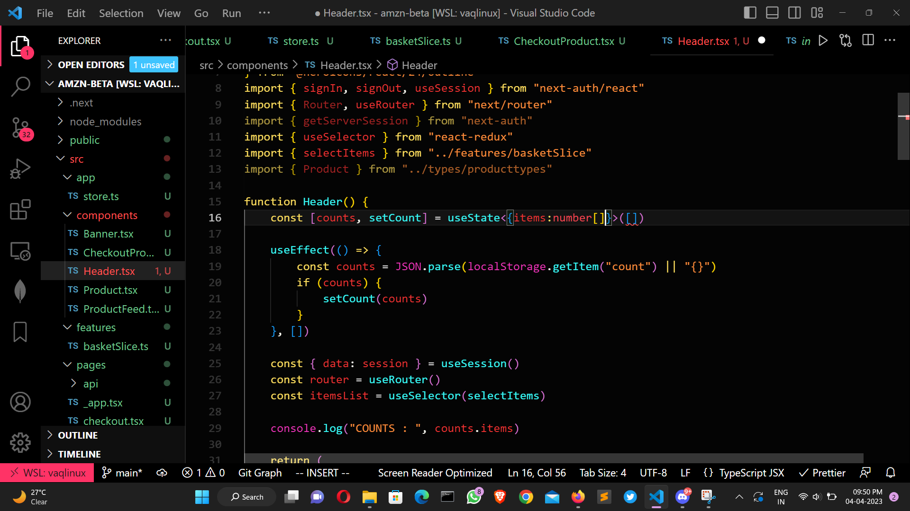

# Endpoint , Model Package , Git

*It is not straightforward to find relevant data for testing the apis. The more you practice the better you get at finding it, after a while , intution starts kicking in and you get better at this.*

## 1. Endpoint

---

#### *Generic way to find an endpoint :*

Search servicename on code browser , you should get *<servicename_>clientconfig* , (result with client config as suffix ).

---

Finding endpoint can get tricky , here are a few steps to find an **endpoint** .

1. If you encounter a service which may have some apis already deployed , try using that endpoint , it usually works .
2. Try finding the model package and endpoint details from the sheet shared by chaitali *<link_to_be_pasted>* .
3. Based on the metadata , try searching the parameters inside metadata randomly on code browser , there is quite high probability that you might find something relevant under the name **ClientConfig**.
4. If you manage to find the versionset , clicking under *show packages that consume this versionset* , you could find something relevant where you might fetch endpoint (need to further elaborate this).
5. There is a website where you can try searching the name of endpoint by typing your service name *(regions.dev)* .
6. On close observation , you will see that the structure of the endpoint is usually : `service_id.regionname.amazonaws.com` .
7. The main regions to try are : `us-east-1 , us-east-2 , us-west-1 , us-west-2` the chances are pretty slim for the endpoint to work , if the region is different from these 4 .
8. There is a way where you can find the region name , if you happen to find the model package , check the pipeline , search for the region where pipeline is deployed . *Releases -> Track in pipelines*
9. There are two files by the name *services.json* and *endpoint_correlation.txt* if you are lucky , you might find your required endpoint over here .

## 2. Model Package

---

1. There is a sheet by the name *Services - Phase 1* and *Model endpoint details* if you are lucky enough , you might get model package name from there . *links to be attatched .*
2. A lot of the times , if you just  search the service name , the model package name appears in suggestions *<service_name>model* (model as  suffix) .
3. If you happen to find the service-internal-name from any sheet which has been shared , try searching that on code browser , you might get model package name .
4. Sometimes , the model package name is not that important , you directly find a service-2 json or c2j folder on code browser , in the build section you can find normal json for c2j and if the apis are present , you can directly proceed from there .
5. There might be instances where in you might find apis in model package but in a different branch , follow the steps below :

   a. Fill appropriate metadata in build json and config of Boto3ModelGeneratorTemplate .

   b. Clone the model package with the required branch .

   c. Build the package with the given versionset . *(Check the releases tab)*

   d. Also , without changing the versionset , build Boto3ModelGeneratorTemplate .

   e. If everything goes as expected , you should see a normal json constructed in build folder of Boto3ModelGeneratorTemplate with required set of apis .

## 3. Git

---

This is a basic guide on renaming a folder in git . if you rename directly using intellij rename and then raise a cr , a copy might get passed instead of the original file getting renamed . Here are a few steps on how to rename a file or a folder in git .

1. Make sure you take the latest pull first .
2. Eg : inside internal-workmailservice you wish to change the name of the dated folder , you go inside Boto3-models->service_models->internal-workmailservice using terminal .
3. Use the command `git mv <old_name> <new_name>` .
4. If you have followed through properly , after typing `git status` you should see the folder/file having status as : `renamed` .

___
| Header 1 | Header 2 | Header 3 |
| -------- | -------- | -------- |
| Row 1, Col 1 | Row 1, Col 2 | Row 1, Col 3 |
| Row 2, Col 1 | Row 2, Col 2 | Row 2, Col 3 |
| Row 3, Col 1 | Row 3, Col 2 | Row 3, Col 3 |
___

1. sdkfhskdjfhsdkjfhsdkjfh
2. skdjfhskdjfhskjdfhskjdhfsdkjfh  
   sdfsdf  
   sdfsdfsdf  
   sdfsdfsdfsdf  
   sdfsfkngsldfjgh

<!--  -->

{width=700px}

skjfhsakjfhaskljdfhaslkjdfhaslkdjfhaskdjfhaskdjfhasdskdjh